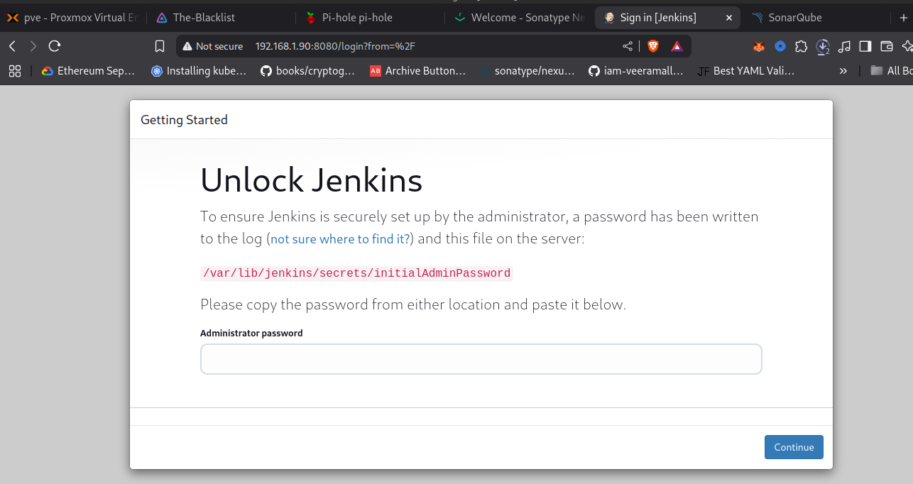

# 💙💚 Blue-Green-Deploy-Practice

This project demonstrates a Blue-Green Deployment strategy using Kubernetes and CI/CD tools. It uses Jenkins for automation, Nexus for artifact storage, and SonarQube for static code analysis — all running as Docker containers for portability and reliability.

---

## 🧾 Requirements

- ✅ Minimum **3 Ubuntu VMs** (Ubuntu 20.04+ recommended)
- ✅ Docker installed on all VMs
- ✅ Sufficient resources: **4GB+ RAM per VM**, especially for Jenkins and SonarQube
- ✅ Basic knowledge working with **Ansible**,**Kubernetes**, **MYSQL**, **Jenkins**, **Linux**, **Git** and **Gitlab** or **GitHub**(but projects uses local gitlab).

### 🌐VM Roles

| VM Role       | Description                                          |
|---------------|------------------------------------------------------|
| **DEVOPS-VM** | Runs Jenkins, Nexus, and SonarQube via Docker        |
| **Master Node** | Kubernetes control plane node                      |
| **Worker Node** | Kubernetes worker node for deployments             |

---
## ⚙️ Deploy Infrastracture with Terraform
### 🚀Cloudinit Template creation on proxmox
Follow these steps **to create Cloudinit Template on proxmox**:
* Manual Link: [Infrastructure-provision/proxmox-cloudinit-template-doc.md](Infrastructure-provision/proxmox-cloudinit-template-doc.md)

### 🚀Deploy VMS
Follow these steps **to deploy the Infrastracture on proxmox**:
* Manual Link: [Infrastructure-provision/README.md](Infrastructure-provision/README.md)
## ⚙️ DevOps VM Setup Instructions
### Deploy with Ansible at once
Follow these steps on below instructions:
* Manual Link: [Deploy_jenkin_nexus_sonarqube/README.md](Deploy_jenkin_nexus_sonarqube/README.md)

## 📽️OR Install manually:
### Install jenkins, sonarqube, trivy, docker, nexus and kubectl

Follow these steps on **DEVOPS-VM**:
* Manual Link: [Manuals/jenkins-setup.md](Manuals/jenkins-setup.md)


---
## ⚙️ Kubernetes Cluster Setup Instructions
### 📽️Deploy with Ansible at once
Follow these steps on **both** master and worker nodes:
* Manual Link: [Deploy_VM_and_K8s_Cluster/README.md](Deploy_VM_and_K8s_Cluster/README.md)

## OR install manually: 
### ☸️ Kubernetes Cluster Setup (Master & Worker Nodes)

Follow these steps on **both** master and worker nodes:
* Manual Link: [Manuals/k8s-setup.md](Manuals/k8s-setup.md)

---

## ✅ After Setup — What's Ready?

- Jenkins: http://DevOps-VM-IP:8080
- Nexus: http://DevOps-VM-IP:8081
- SonarQube: http://DevOps-VM-IP:9000
- Kubernetes cluster (master + worker) is ready
- All services restart on VM reboot (via Docker `--restart=always`)
#### Jenkins Dashboard
 

#### Sonarqube Dashboard
 

#### Nexus Dashboard
 
---
## 🚀 All Jenkins Configurations
Detailed walkthrough Link here: [Manuals/conf_jenkins.md](Manuals/conf_jenkins.md)

## 🌐Pipeline in JenkinsFile
###  🌐Pipeline Structure
#### The Jenkinsfile
* Find the Jenkinsfile here: [Jenkinsfile/Jenkinsfile](Jenkinsfile/Jenkinsfile) <br>
* Detailed walkthrough Link here: [Manuals/Jenkinfile.md](Manuals/Jenkinfile.md)

## Pipeline setup 
🛠️ Jenkins Pipeline Setup (Credentials & Configs)
When setting up the Jenkins pipeline, remember to edit the following parts inside your Jenkinsfile to match the names of your configured credentials and tools in Jenkins:
### 🔐 Credentials & Tools Setup

| **Jenkins Function**                         | **Required Jenkins Config Name**                              |
|---------------------------------------------|---------------------------------------------------------------|
| `withDockerRegistry(...)`                   | `docker-blue-green-cicd` *(DockerHub cred)*                   |
| `git(... credentialsId: ...)`               | `gitcred-blue-green-cicd` *(GitLab cred)*                     |
| `withMaven(... globalMavenSettingsConfig)`  | `maven-settings` *(Global Maven Settings)*                    |
| `withSonarQubeEnv('...')`                   | `sonar` *(SonarQube server name)*                             |
| `withKubeConfig(... credentialsId)`         | `k8-token` *(Kubernetes service account token)*               |
| `tool 'sonar-scanner'`                      | `sonar-scanner` *(Sonar scanner tool in Jenkins configuration)* |

### 🧩 Environment Variables Setup (Inside environment { ... })
Make sure these are present and correctly configured:
```
environment {
    IMAGE_NAME = "mwakazi/bankapp"            // Docker image name
    TAG = "${params.DOCKER_TAG}"              // Image tag: blue or green
    KUBE_NAMESPACE = 'webapps'                // Kubernetes namespace
    SCANNER_HOME = tool 'sonar-scanner'       // Sonar scanner tool name
    ENGINEER_MAIL = 'mwakazieric@gmail.com'   // Email to receive notifications
}

```
### ✅ Before Running Pipeline:
Add Jenkins credentials with matching IDs.

Configure SonarQube server in Jenkins (Manage Jenkins > Configure System).

Configure Maven settings under Manage Jenkins > Global Tool Configuration.

Configure Kubernetes cluster credentials and service token.

Add DockerHub and GitLab credentials in Jenkins Credentials store.


## 🚀 References:
* YouTube Video Link To follow along: [https://www.youtube.com/watch?v=tstBG7RC9as&t=2759s](https://www.youtube.com/watch?v=tstBG7RC9as&t=2759s)
* Jenkins Plugin Documentation: [https://www.jenkins.io/doc/book/managing/plugins/](https://www.jenkins.io/doc/book/managing/plugins/)
* Trivy GitHub Repository: [hhttps://github.com/aquasecurity/trivy](https://github.com/aquasecurity/trivy)
* Kubernetes Installation Guide: [https://kubernetes.io/docs/setup/](https://kubernetes.io/docs/setup/)
* Terraform with proxmox: [https://registry.terraform.io/providers/Telmate/proxmox/latest/docs](https://registry.terraform.io/providers/Telmate/proxmox/latest/docs)


---
## 📦 Contributing

**Pull requests are welcome. Feel free to fork, try,mess around, even better suggest any improvements this deployment guide!**

## 👨‍💻 Author

Generated by [@Eric mwakazi](https://www.linkedin.com/in/eric-mwakazi) – Automating cloud-native infrastructure in homelabs and production.

Happy DevOpsing! 🙌
